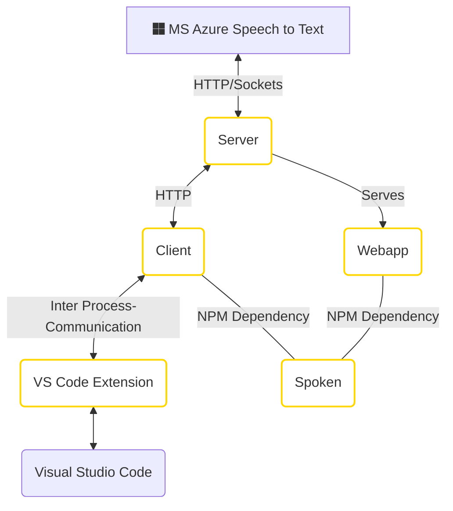

# Speech To Code &nbsp;&nbsp;[](https://github.com/pedrooaugusto/speech-to-code/actions)

> Code using your voice

### Web Demo

You can try a live demo of Speech2Code here: https://pedrooaugusto.github.io/speech-to-code/webapp 

You can also check this video on how to solve the FizzBuzz problem using Speech2Code: https://www.youtube.com/watch?v=I71ETEeqa5E

_(for this demo the app was ported to the web, to run directly on the browser)_

### Overview

Speech2Code is an application that enables you to code using just voice comands, with Speech2Code instead of using the keyboard to write code in the code editor ~~like a caveman~~ you can just express in natural language what you wish to do and that will be automatically written, as code, in the code editor.

Using Speech2Code instead of using the mouse and keyboard to navigate to line 42 of a file, you can just say: _"line 42"_, _"go to line 42"_ or even _"please go to line 42"_. It's possible to say stuff like:

* _new variable answer equals the string john was the eggman string_
    * ```javascript
        let answer = "john was the eggman"
        ```

* _call function max with arguments variable answer and expression gap plus number 42 on namespace Math_
    * ```javascript
        Math.max(answer, gap + 42) // 'gap' can later be replaced later by an actual value
        ```

This project can be divided into 3 main modules:

1. [Webapp](/webapp), [Server](/server) and [Client](/client): are responsible for the application UI, capture audio and transform audio into text.

2. [Spoken](/spoken): is responsible for testing if a given phrase is a valid voice command and to extract important information out of it (parse).

3. [Spoken  VSCode Extension](/spoken-vscode-driver): is a Visual Studio Code extension able to receive commands to manipulate VSCode. Is through this extension that Speech2Code is able to control the Visual Studio Code.

**Those modules interact as follows:**



### Voice Commands

Voice commands are transformed into text using the [Azure Speech to Text](https://azure.microsoft.com/en-us/services/cognitive-services/speech-to-text/?cdn=disable#features) service and later parsed by [Spoken](/spoken), which makes use of several pushdown automaton to extract information of the text.

Currently, Speech2Code only supports voice commands for the JavaScript language, a list of all those commands can be found [here](spoken/src/modules/typescript). All commands can be said in both english and portuguese ~~HU3BR~~.

### Controlling Visual Studio Code

Speech2Code was designed to work with any IDE that implements its [interface](https://github.com/pedrooaugusto/speech-to-code/blob/main/spoken/src/modules/d.ts#L17), this is usually done through plugins and extensions. Currently, it has support for Visual Studio Code and CodeMirror.

For example, the voice command _"call function fish with two arguments"_ will eventually call  for [`editor.write(...)`](https://github.com/pedrooaugusto/speech-to-code/blob/main/spoken/src/modules/typescript/function_call/impl.ts#L30) where editor can be any IDE/Editor like vscode, codemirror and sublime and each will have a different implementation for `write(...)`. The only common thing is that calling that function will write something in the current open file, no matter the IDE. Here you have an example of different implementations of the same function: [VSCode.write(...)](https://github.com/pedrooaugusto/speech-to-code/blob/main/spoken-vscode-driver/src/robot-vscode.ts#L19) x [CodeMirror.write(...)](https://github.com/pedrooaugusto/speech-to-code/blob/main/webapp/src/services/chrome/editor.ts#L30)

The connection between VSCode and Speech2Code is done through a custom VSCode extension and Inter-Process Communication.

### Running this project

First, install all the  required dependencies with:

`node scripts.js install`

Then, you can start the server with:

`./run.sh`

A web based demo of *Speech2Code* will be accessible through: http://localhost:3000/webapp

Finnaly, if you wish to start the actual application run (make sure that VSCode is running before doing that):

`npm --prefix client start`

_Dont forget to edit `server/.env` with your azure speech-to-text API keys._

### Resources

Non code-like material produced in the creation of this project:

1. [Undergratuate dissertation on this project](https://pedrooaugusto.github.io/Programming%20With%20Voice%20-%20Assistive%20Technology%20Tool%20For%20Programming%20In%20JavaScript%20Using%20Voice%20-%20Pedro%20Silva.pdf).
2. [Figma design: application screens, icons and images used in the dissertation](https://www.figma.com/file/glanqRtfVtW2Va1wybr5pkCh/TCC?node-id=18%3A2).
3. [Trello board used  before everything went south](https://trello.com/b/vdqj47pg/tcc).

