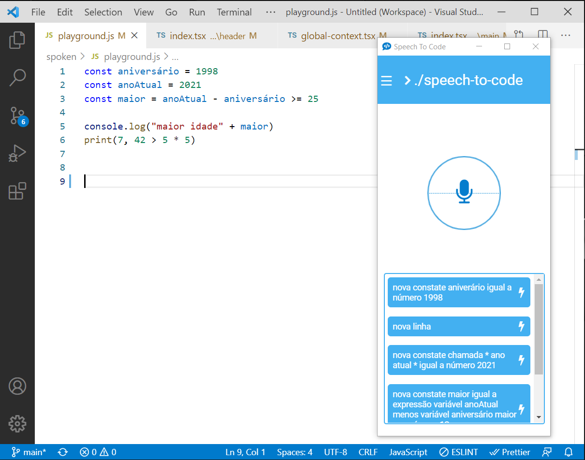

# VSCode Spoken Driver

Spoken is a VSCode extension that allows you to code using just your voice.

## Features

Enables you to code using just your voice, this the bridge between the main Spoken app and VSCode.

You do need the main spoken App to use this extension properly!

## Requirements

VSCode version 1.55.2 or newer

## Release Notes

### 0.0.2

**New interactions**:
* Get current file info, like name and path
* Write on terminal
* Major bugfixes on *#select()* and *#getLine()*

### 0.0.1

Initial release of Spoken, just common commands

**Enjoy!**
