# Typescript voice commands

> 🤖 This document was auto generated by spoken/src/build/build-docs.js

Collection of voice commands of the typescript language

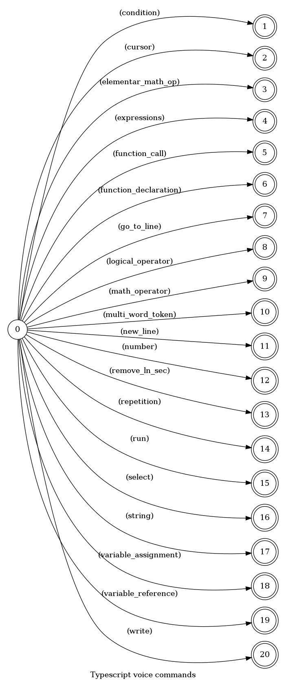

---

## Creates a if/else statement

Creates a if/else statement with the provided expression as condition

### Languages

This command is available in the following languages

#### English

The following automata is responsible for recognizing the command `Creates a if/else statement` in english:

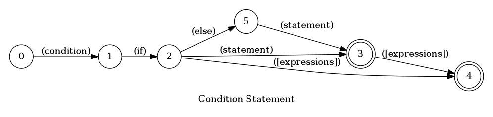

The following are some examples of phrases, in english, used to trigger the command `Creates a if/else statement`:

1. conditional statement
2. conditional statement gap
3. conditional statement if expression text H E L L O text less or equals than [elementar_math_op]
4. conditional statement if else text H E L L O text

#### Português

O automata seguinte é reponsável por reconhecer o comando `Estrutura condicional` em português:

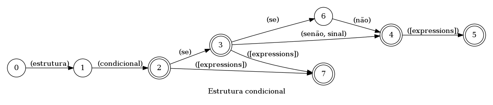

Os seguintes exemplos de frases, em português, podem ser usadas para ativar o comando `Estrutura condicional`:

1. estrutura condicional
2. estrutura condicional texto U S A texto
3. estrutura condicional se expressão verdadeiro módulo texto U S A texto
4. estrutura condicional se senão constante chamada aspas preço total aspas

### Implementation

The full implementation of this command can be found on this directory under the file [impl.ts](impl.ts)

```typescript
import { ParsedPhrase, Editor, WildCard } from '../../d'
import { Context } from '../../../modules-loader'

async function Condition(command: ConditionParsedArgs, editor: Editor, context: Context) {
    console.log('[Spoken]: Executing: "Condition."')
    
    const anything = context.template

(...)
```

---

## Move cursor

Moves the cursor to a different line or token

### Languages

This command is available in the following languages

#### English

The following automata is responsible for recognizing the command `Move cursor` in english:

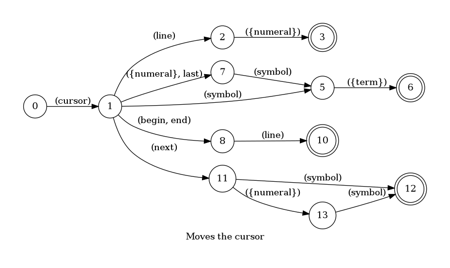

The following are some examples of phrases, in english, used to trigger the command `Move cursor`:

1. pointer line 21
2. pointer line 44
3. cursor line 23
4. pointer end of line
5. pointer begin of line
6. pointer first letter A
7. pointer next five symbols

#### Português

O automata seguinte é reponsável por reconhecer o comando `Mover o cursor` em português:

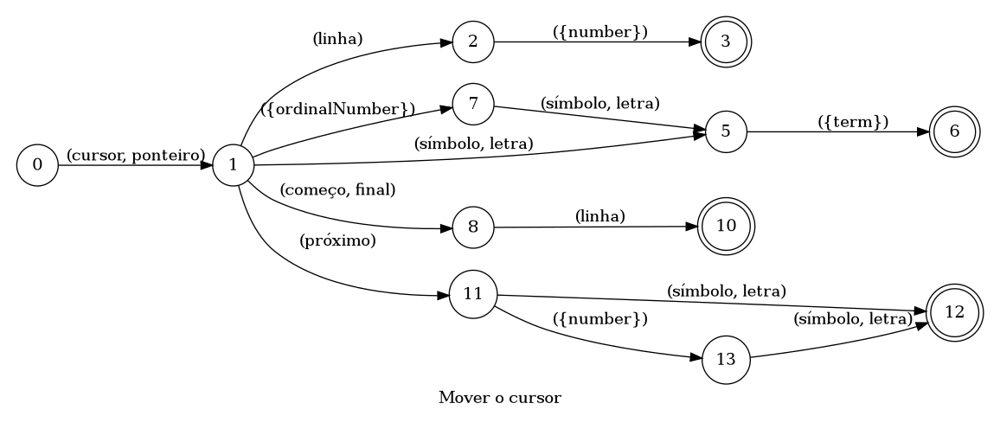

Os seguintes exemplos de frases, em português, podem ser usadas para ativar o comando `Mover o cursor`:

1. ponteiro linha 21
2. ponteiro linha 44
3. cursor linha 23
4. ponteiro final da linha
5. ponteiro começo da linha
6. ponteiro primeira letra A
7. ponteiro próximos 5 símbolos

### Implementation

The full implementation of this command can be found on this directory under the file [impl.ts](impl.ts)

```typescript
import { ParsedPhrase, Editor, WildCard } from '../../d'

async function cursor(args: CursorParsedArgs, editor: Editor, context: {}) {
    console.log('[Spoken]: Executing: "cursor."')

    if (args.linePosition != null) {
        const pos = args.linePosition === LinePostionEnum.BEGIN ? 'BEGI

(...)
```

---

## Writes a elementar math operation

Writes a elementar math operation (*, -, +, /)

### Languages

This command is available in the following languages

#### English

The following automata is responsible for recognizing the command `Writes a elementar math operation` in english:

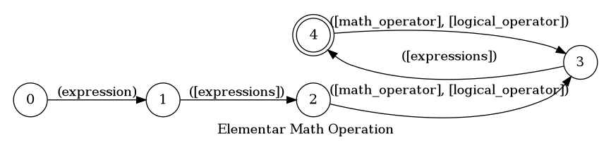

The following are some examples of phrases, in english, used to trigger the command `Writes a elementar math operation`:

1. expression [elementar_math_op] minus 123
2. expression text H E L L O text less or equals than [elementar_math_op]

#### Português

O automata seguinte é reponsável por reconhecer o comando `Escreve uma operação matemática elementar` em português:

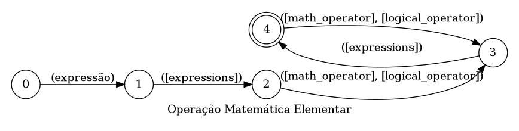

Os seguintes exemplos de frases, em português, podem ser usadas para ativar o comando `Escreve uma operação matemática elementar`:

1. expressão verdadeiro módulo texto U S A texto
2. expressão gap não e número 14

### Implementation

The full implementation of this command can be found on this directory under the file [impl.ts](impl.ts)

```typescript
import { ParsedPhrase, Editor, WildCard } from '../../d'

async function WriteElementarMathOperation(command: WriteElementarMathOperationParsedArgs, editor: Editor, context: {}) {
    console.log('[Spoken]: Executing: "WriteElementarMathOperation"')

    let operation = toArray(command.operatio

(...)
```

---

## Writes a expression

Writes a expression in the editor, this is meant to be used inside another automatas

### Languages

This command is available in the following languages

#### English

The following automata is responsible for recognizing the command `Writes a expression` in english:

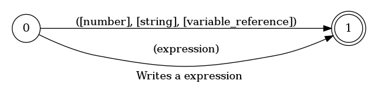

The following are some examples of phrases, in english, used to trigger the command `Writes a expression`:

1. false
2. true
3. gap
4. 123
5. text H E L L O text
6. reference constant called quote blue car quote
7. expression text H E L L O text less or equals than [elementar_math_op]
8. execute function remove on true with arguments text H E L L O text and text H E L L O text

#### Português

O automata seguinte é reponsável por reconhecer o comando `Escreve uma expressão` em português:

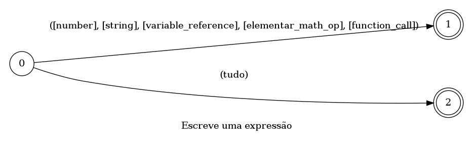

Os seguintes exemplos de frases, em português, podem ser usadas para ativar o comando `Escreve uma expressão`:

1. falso
2. verdadeiro
3. gap
4. número 14
5. texto U S A texto
6. constante chamada aspas preço total aspas
7. expressão verdadeiro módulo texto U S A texto
8. execute a função remover no verdadeiro com os argumentos [function_call] e falso

### Implementation

The full implementation of this command can be found on this directory under the file [impl.ts](impl.ts)

```typescript
import { ParsedPhrase, Editor, WildCard } from '../../d'

async function Expression(command: ExpressionParsedArgs, editor: Editor, context: {}) {
    console.log('[Spoken]: Executing: "Expression"')

    let { expression, parent, wildCard, booleanConstants } = command

    // really ??? (fix 

(...)
```

---

## Calls a function

Calls a function with the specified arguments in the desired caller

### Languages

This command is available in the following languages

#### English

The following automata is responsible for recognizing the command `Calls a function` in english:

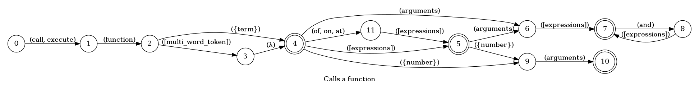

The following are some examples of phrases, in english, used to trigger the command `Calls a function`:

1. call function test
2. execute function normalize on true with 2 arguments
3. execute function remove on true with arguments text H E L L O text and text H E L L O text

#### Português

O automata seguinte é reponsável por reconhecer o comando `Chama uma função` em português:

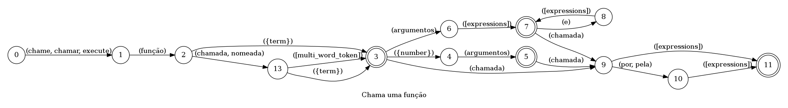

Os seguintes exemplos de frases, em português, podem ser usadas para ativar o comando `Chama uma função`:

1. execute a função teste
2. execute a função normalizar no verdadeiro com 2 argumentos
3. execute a função remover no verdadeiro com os argumentos [function_call] e falso

### Implementation

The full implementation of this command can be found on this directory under the file [impl.ts](impl.ts)

```typescript
import { Context } from '../../../modules-loader'
import { ParsedPhrase, Editor, WildCard } from '../../d'

async function FunctionCall(command: FunctionCallParsedArgs, editor: Editor, context: Context) {
    console.log('[Spoken]: Executing: "FunctionCall"')

    const anything = context.temp

(...)
```

---

## Creates a function

Creates a function with the desired number of args and return value

### Languages

This command is available in the following languages

#### English

The following automata is responsible for recognizing the command `Creates a function` in english:


The following are some examples of phrases, in english, used to trigger the command `Creates a function`:

1. declare function multiply with 123 arguments
2. declare function multiply with 2 arguments return 123
3. declare function divide return reference constant called quote blue car quote

#### Português

O automata seguinte é reponsável por reconhecer o comando `Cria uma função` em português:


Os seguintes exemplos de frases, em português, podem ser usadas para ativar o comando `Cria uma função`:

1. nova função multiplicar com número 43 argumentos
2. nova função multiplicar com 2 argumentos retorna expressão verdadeiro módulo texto U S A texto
3. declare a função dividir retornando falso

### Implementation

The full implementation of this command can be found on this directory under the file [impl.ts](impl.ts)

```typescript
import { Context } from '../../../modules-loader'
import { ParsedPhrase, Editor, WildCard } from '../../d'

async function FunctionDeclaration(command: FunctionDeclarationParsedArgs, editor: Editor, context: Context) {
    console.log('[Spoken]: Executing: "FunctionDeclaration"')

    const an

(...)
```

---

## Change line

Moves the cursor to a different line

### Languages

This command is available in the following languages

#### English

The following automata is responsible for recognizing the command `Change line` in english:


The following are some examples of phrases, in english, used to trigger the command `Change line`:

1. go to line number 14
2. go to line number number one
3. line number 123
4. line number five

#### Português

O automata seguinte é reponsável por reconhecer o comando `Trocar linha` em português:


Os seguintes exemplos de frases, em português, podem ser usadas para ativar o comando `Trocar linha`:

1. linha número 14
2. vá para a linha número 14
3. linha número número dois
4. linha número 14

### Implementation

The full implementation of this command can be found on this directory under the file [impl.ts](impl.ts)

```typescript
import { Context } from '../../../modules-loader'
import { ParsedPhrase, Editor, WildCard } from '../../d'

async function goToLine(command: GoToLineParsedArgs, editor: Editor, context: {}) {
    console.log('[Spoken]: Executing: "goToLine."')

    return await editor.goToLine(command.line as 

(...)
```

---

## Writes a logical operator

Writes a logical operator (===, !==, &&, ||, >, <, >=, <=) meant to be used inside expressions

### Languages

This command is available in the following languages

#### English

The following automata is responsible for recognizing the command `Writes a logical operator` in english:


The following are some examples of phrases, in english, used to trigger the command `Writes a logical operator`:

1. and
2. or
3. equals
4. less than
5. greater than
6. less or equals than
7. greater or equals than
8. not equals
9. negative equals
10. negative and
11. negative or

#### Português

O automata seguinte é reponsável por reconhecer o comando `Escreve um operador lógico` em português:


Os seguintes exemplos de frases, em português, podem ser usadas para ativar o comando `Escreve um operador lógico`:

1. e
2. ou
3. igual
4. menor que
5. maior que
6. menor ou igual a
7. maior ou igual a
8. não igual
9. negativo igual
10. não e
11. não ou

### Implementation

The full implementation of this command can be found on this directory under the file [impl.ts](impl.ts)

```typescript
import { Context } from '../../../modules-loader'
import { ParsedPhrase, Editor, WildCard } from '../../d'

async function LogicalOperator(command: LogicalOperatorParsedArgs, editor: Editor, context: {}) {
    console.log('[Spoken]: Executing: "LogicalOperator"')

    const { logicalOperator, 

(...)
```

---

## Writes a math operator

Writes a math operator (*, -, +, /, %) meant to be used inside expressions

### Languages

This command is available in the following languages

#### English

The following automata is responsible for recognizing the command `Writes a math operator` in english:


The following are some examples of phrases, in english, used to trigger the command `Writes a math operator`:

1. plus
2. times
3. minus
4. divided by
5. module

#### Português

O automata seguinte é reponsável por reconhecer o comando `Escreve uma operador matemático` em português:


Os seguintes exemplos de frases, em português, podem ser usadas para ativar o comando `Escreve uma operador matemático`:

1. mais
2. vezes
3. menos
4. dividido por
5. módulo

### Implementation

The full implementation of this command can be found on this directory under the file [impl.ts](impl.ts)

```typescript
import { Context } from '../../../modules-loader'
import { ParsedPhrase, Editor, WildCard } from '../../d'

async function MathOperator(command: MathOperatorParsedArgs, editor: Editor, context: {}) {
    console.log('[Spoken]: Executing: "MathOperator"')

    const { mathOperator } = command


(...)
```

---

## Group multiple words together

Group multiple words together in one variable meant to be used as alias in other commands

### Languages

This command is available in the following languages

#### English

The following automata is responsible for recognizing the command `Group multiple words together` in english:

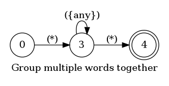

The following are some examples of phrases, in english, used to trigger the command `Group multiple words together`:

1. quote blue car quote
2. quote multi word token quote
3. quote to upper case quote
4. quote to string quote
5. quote to integer quote
6. quote is null quote
7. quote has next quote
8. quote is full quote
9. quote camel case quote
10. quote get string could quote
11. quote get color quote
12. quote really good function quote
13. quote U S A quote
14. quote W H O quote
15. quote F A T O S quote

#### Português

O automata seguinte é reponsável por reconhecer o comando `Agrupa múltiplas palavras` em português:

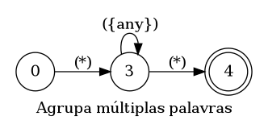

Os seguintes exemplos de frases, em português, podem ser usadas para ativar o comando `Agrupa múltiplas palavras`:

1. aspas carro azul aspas
2. aspas nome composto de múltiplas palavras aspas
3. aspas frase parseada aspas
4. aspas transação crédito texto aspas
5. aspas preço total aspas
6. aspas preço por item aspas
7. aspas W H O aspas
8. aspas N U L L aspas
9. aspas A B C D aspas
10. aspas camel case aspas
11. * hola me nombre es felipe *

### Implementation

The full implementation of this command can be found on this directory under the file [impl.ts](impl.ts)

```typescript
import { Context } from '../../../modules-loader'
import { ParsedPhrase, Editor, WildCard } from '../../d'

async function MultiWordTokens(command: MultiWordTokensParsedArgs, editor: Editor, context: {}) {
    console.log('[Spoken]: Executing: "MultiWordTokens"')

    function camelCase(words:

(...)
```

---

## New line

Creates a new line above or below the current line

### Languages

This command is available in the following languages

#### English

The following automata is responsible for recognizing the command `New line` in english:

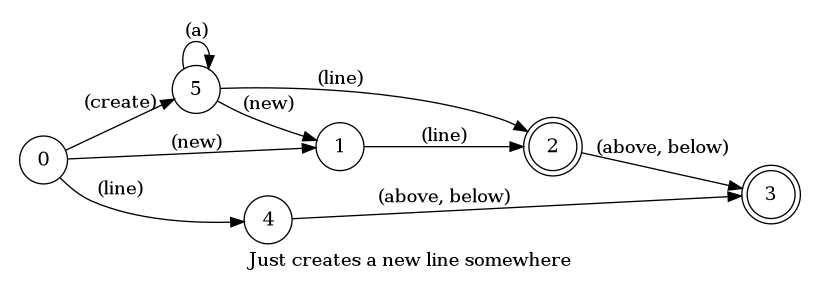

The following are some examples of phrases, in english, used to trigger the command `New line`:

1. create line
2. create a line
3. create line above
4. create line below

#### Português

O automata seguinte é reponsável por reconhecer o comando `Linha nova` em português:

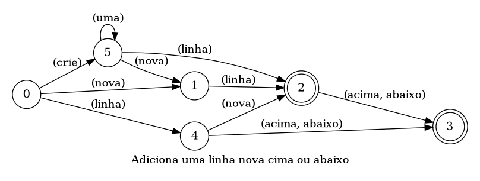

Os seguintes exemplos de frases, em português, podem ser usadas para ativar o comando `Linha nova`:

1. criar linha
2. nova linha
3. nova linha acima
4. nova linha abaixo

### Implementation

The full implementation of this command can be found on this directory under the file [impl.ts](impl.ts)

```typescript
import { Context } from '../../../modules-loader'
import { ParsedPhrase, Editor, PositionEnum } from '../../d'

async function newLine(command: NewLineParsedArgs, editor: Editor, context: {}) {
    console.log('[Spoken]: Executing: "new line."')

    return await editor.newLine(command.positio

(...)
```

---

## Writes a number

Writes a number in the editor

### Languages

This command is available in the following languages

#### English

The following automata is responsible for recognizing the command `Writes a number` in english:


The following are some examples of phrases, in english, used to trigger the command `Writes a number`:

1. number one
2. number four
3. number five
4. number 43
5. number 14
6. number 140
7. 140
8. 123
9. 42
10. 18

#### Português

O automata seguinte é reponsável por reconhecer o comando `Escreve um número` em português:


Os seguintes exemplos de frases, em português, podem ser usadas para ativar o comando `Escreve um número`:

1. número dois
2. número quatro
3. número cinco
4. número 43
5. número 14
6. número 140

### Implementation

The full implementation of this command can be found on this directory under the file [impl.ts](impl.ts)

```typescript
import { Context } from '../../../modules-loader'
import { ParsedPhrase, Editor, WildCard } from '../../d'

async function WriteNumber(command: WriteNumberParsedArgs, editor: Editor, context: {}) {
    console.log('[Spoken]: Executing: "WriteNumber"')

    const { number, parent } = command


(...)
```

---

## Remove

Removes the current line or the current selection

### Languages

This command is available in the following languages

#### English

The following automata is responsible for recognizing the command `Remove` in english:


The following are some examples of phrases, in english, used to trigger the command `Remove`:

1. remove line
2. remove selection

#### Português

O automata seguinte é reponsável por reconhecer o comando `Remover` em português:


Os seguintes exemplos de frases, em português, podem ser usadas para ativar o comando `Remover`:

1. remover linha
2. remova linha
3. remover seleção

### Implementation

The full implementation of this command can be found on this directory under the file [impl.ts](impl.ts)

```typescript
import { Context } from '../../../modules-loader'
import { ParsedPhrase, Editor, WildCard } from '../../d'

async function remove(command: RemoveParsedArgs, editor: Editor, context: Context) {
    console.log('[Spoken]: Executing: "remove line/selection."')

    if (command.isLine) {
        

(...)
```

---

## Creates a for loop statement

Creates a for loop statement with the provided expressions as parameters

### Languages

This command is available in the following languages

#### English

The following automata is responsible for recognizing the command `Creates a for loop statement` in english:


The following are some examples of phrases, in english, used to trigger the command `Creates a for loop statement`:

1. repetition statement from number four to 123
2. repetition statement from number 43 to number four step expression variable i plus number 5
3. repetition statement for every car of constant cars
4. repetition statement for every animal of earth
5. repetition statement for every prime of variable primes

#### Português

O automata seguinte é reponsável por reconhecer o comando `Estrutura de repetição` em português:


Os seguintes exemplos de frases, em português, podem ser usadas para ativar o comando `Estrutura de repetição`:

1. estrutura de repetição do número cinco até número cinco
2. estrutura de repetição do número 43 até número cinco etapa expressão variável i mais número 5
3. estrutura de repetição para todo carro em constante carros
4. estrutura de repetição para todo animal na terra
5. estrutura de repetição para todo primo na variável primos

### Implementation

The full implementation of this command can be found on this directory under the file [impl.ts](impl.ts)

```typescript
import { Context } from '../../../modules-loader'
import { ParsedPhrase, Editor, WildCard } from '../../d'

async function Repetition(command: RepetitionParsedArgs, editor: Editor, context: Context) {
    console.log('[Spoken]: Executing: "Repetition."')
    
    const gap = context.templates[

(...)
```

---

## Run current file

Run the current file in the terminal using node

### Languages

This command is available in the following languages

#### English

The following automata is responsible for recognizing the command `Run current file` in english:


The following are some examples of phrases, in english, used to trigger the command `Run current file`:

1. run current file
2. run this file

#### Português

O automata seguinte é reponsável por reconhecer o comando `Executar arquivo` em português:


Os seguintes exemplos de frases, em português, podem ser usadas para ativar o comando `Executar arquivo`:

1. executar este arquivo
2. executar arquivo atual

### Implementation

The full implementation of this command can be found on this directory under the file [impl.ts](impl.ts)

```typescript
import { Context } from '../../../modules-loader'
import { ParsedPhrase, Editor, WildCard } from '../../d'

async function run(command: RunParsedArgs, editor: Editor, context: {}) {
    console.log('[Spoken]: Executing: "run."')

    const info = await editor.fileInfo() as { fileName: string }

(...)
```

---

## Select

Select a piece of the text in the current line

### Languages

This command is available in the following languages

#### English

The following automata is responsible for recognizing the command `Select` in english:


The following are some examples of phrases, in english, used to trigger the command `Select`:

1. select the letter B
2. select the symbol 5
3. select the letter Q
4. select the first letter B
5. select the second letter K
6. select the last workd this
7. select the word ball
8. select the word quote get color quote
9. select from line 2 to line 15
10. select from line number 45 to line 90
11. select from letter A to letter Z
12. select from second leter G to last letter P

#### Português

O automata seguinte é reponsável por reconhecer o comando `Selecionar` em português:


Os seguintes exemplos de frases, em português, podem ser usadas para ativar o comando `Selecionar`:

1. selecione a letra B
2. selecione a símbolo 5
3. selecione a letra Q
4. selecione a primeira letra B
5. selecione a segunda letra K
6. selecione a última palavra valor
7. selecione a palavra lista
8. selecione a palavra aspas camel case aspas
9. selecione da linha 2 até a linha 15
10. selecione da linha número 45 até a linha 90
11. selecione da letra A até a letra Z
12. selecione da segunda letra G até a última letra P

### Implementation

The full implementation of this command can be found on this directory under the file [impl.ts](impl.ts)

```typescript
import { Context } from '../../../modules-loader'
import { ParsedPhrase, Editor, WildCard } from '../../d'

async function Select(command: SelectParsedArgs, editor: Editor, context: {}) {
    console.log('[Spoken]: Executing: "select"')

    command.word = Array.isArray(command.word) ? command

(...)
```

---

## Writes a string

Writes a string in the editor

### Languages

This command is available in the following languages

#### English

The following automata is responsible for recognizing the command `Writes a string` in english:


The following are some examples of phrases, in english, used to trigger the command `Writes a string`:

1. string hello world string
2. string null pointer exeception is bad string
3. text this can be any piece of writing text
4. string hello my name is giovani girogio string
5. text what is happening peter text
6. text H E L L O text
7. string O N U string
8. string U S A string

#### Português

O automata seguinte é reponsável por reconhecer o comando `Escreve uma string` em português:


Os seguintes exemplos de frases, em português, podem ser usadas para ativar o comando `Escreve uma string`:

1. string olá mundo string
2. string erros de ponteiro nulos são ruims string
3. texto podemos dizer qualquer frase texto
4. string Olá meu nome é Giovani Giorgio string
5. texto e ele vai ligar pra todas até achar uma gata pra dar um passeio texto
6. texto U S A texto
7. texto B R T texto
8. string G R A S S string

### Implementation

The full implementation of this command can be found on this directory under the file [impl.ts](impl.ts)

```typescript
import { Context } from '../../../modules-loader'
import { ParsedPhrase, Editor, WildCard } from '../../d'

async function WriteString(command: WriteStringParsedArgs, editor: Editor, context: {}) {
    console.log('[Spoken]: Executing: "WriteString"')

    command.string = Array.isArray(comman

(...)
```

---

## Undo or redo the last operation/command

Undo or redo the last operation, used to correct mistakes. Just like CTRL + (Z | Y).

### Languages

This command is available in the following languages

#### English

The following automata is responsible for recognizing the command `Undo or redo the last operation/command` in english:


The following are some examples of phrases, in english, used to trigger the command `Undo or redo the last operation/command`:

1. undo that
2. undo that again
3. redo the last operation
4. undo the last operation again
5. redo that

#### Português

O automata seguinte é reponsável por reconhecer o comando `Refazer ou desfazer a última operação` em português:


Os seguintes exemplos de frases, em português, podem ser usadas para ativar o comando `Refazer ou desfazer a última operação`:

1. desfaça isso
2. desfazer isto
3. desfaça a última operação
4. refaça isso
5. refazer a última operação

### Implementation

The full implementation of this command can be found on this directory under the file [impl.ts](impl.ts)

```typescript
import { Context } from '../../../modules-loader'
import { ParsedPhrase, Editor, WildCard } from '../../d'

async function undoRedo(command: RunParsedArgs, editor: Editor, context: {}) {
    console.log('[Spoken]: Executing: "Undo/Redo."')

    const task = command.task

    if (task === 0)

(...)
```

---

## Stores a value in a variable

Stores a number, string etc in a variable

### Languages

This command is available in the following languages

#### English

The following automata is responsible for recognizing the command `Stores a value in a variable` in english:


The following are some examples of phrases, in english, used to trigger the command `Stores a value in a variable`:

1. new variable value equals false
2. variable called batch equals reference constant called quote blue car quote
3. declare variable called quote F A T O S quote equals text H E L L O text

#### Português

O automata seguinte é reponsável por reconhecer o comando `Guarda um valor em uma variável` em português:


Os seguintes exemplos de frases, em português, podem ser usadas para ativar o comando `Guarda um valor em uma variável`:

1. nova variável valor igual a texto U S A texto
2. variável valor igual a falso
3. nova variável chamada aspas W H O aspas igual a expressão verdadeiro módulo texto U S A texto

### Implementation

The full implementation of this command can be found on this directory under the file [impl.ts](impl.ts)

```typescript
import { Context } from '../../../modules-loader'
import { ParsedPhrase, Editor, WildCard } from '../../d'

async function NewVariable(command: NewVariableParsedArgs, editor: Editor, context: {}) {
    console.log('[Spoken]: Executing: "NewVariable"')

    let { isNew, varName, expression, mem

(...)
```

---

## References a variable

Writes a variable or constant in the editor

### Languages

This command is available in the following languages

#### English

The following automata is responsible for recognizing the command `References a variable` in english:

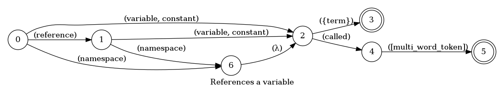

The following are some examples of phrases, in english, used to trigger the command `References a variable`:

1. variable value
2. variable label
3. constant name
4. constant age
5. constant language
6. namespace color
7. reference variable horse
8. reference constant bike
9. reference namespace bike
10. namespace called quote is full quote
11. constant called quote U S A quote
12. variable called quote F A T O S quote
13. reference variable called quote to integer quote
14. reference constant called quote blue car quote

#### Português

O automata seguinte é reponsável por reconhecer o comando `Referencia a uma variável` em português:

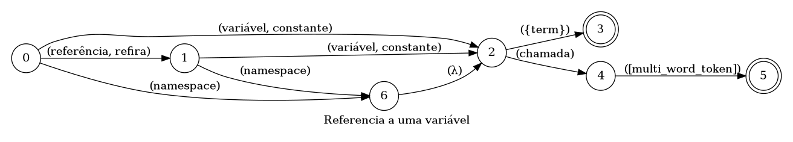

Os seguintes exemplos de frases, em português, podem ser usadas para ativar o comando `Referencia a uma variável`:

1. variável valor
2. variável descrição
3. constante name
4. constante idade
5. constante linguagem
6. namespace cor
7. referência variável cavalo
8. referência constante bicicleta
9. referência namespace bicicleta
10. namespace chamado aspas nome composto de múltiplas palavras aspas
11. constante chamada aspas preço total aspas
12. variável chamada aspas preço total aspas
13. referêncie variável chamada aspas nome composto de múltiplas palavras aspas
14. referêncie constante chamada aspas preço por item aspas

### Implementation

The full implementation of this command can be found on this directory under the file [impl.ts](impl.ts)

```typescript
import { Context } from '../../../modules-loader'
import { ParsedPhrase, Editor, WildCard } from '../../d'

async function VariableReference(command: VariableReferenceParsedArgs, editor: Editor, context: {}) {
    console.log('[Spoken]: Executing: "VariableReference"')

    let { varName, pare

(...)
```

---

## Write text

Write some text in the editor

### Languages

This command is available in the following languages

#### English

The following automata is responsible for recognizing the command `Write text` in english:


The following are some examples of phrases, in english, used to trigger the command `Write text`:

1. write hello how are you friend
2. print my name is Giovani
3. print it down how are you mate
4. write letter B and letter E and letter T

#### Português

O automata seguinte é reponsável por reconhecer o comando `Escrever texto` em português:


Os seguintes exemplos de frases, em português, podem ser usadas para ativar o comando `Escrever texto`:

1. escreva ola como vai você
2. escreva apenas um teste
3. escreva meu nome é giovani girogio
4. escreva letra a B e letra O e letra I

### Implementation

The full implementation of this command can be found on this directory under the file [impl.ts](impl.ts)

```typescript
import { Context } from '../../../modules-loader'
import { ParsedPhrase, Editor } from '../../d'

async function write(command: WriteParsedArgs, editor: Editor, context: Context) {
    console.log('[Spoken]: Executing: "write."')

    let text = null

    if (command.isSpace) text = ' '
   

(...)
```

---