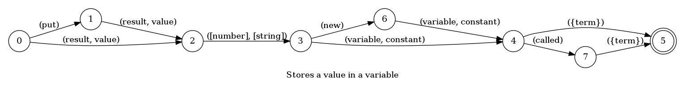
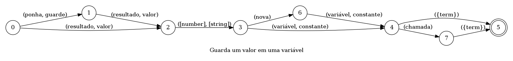

# Typescript voice commands

Collection of voice commands of the typescript language


---

## Move cursor

Moves the cursor to a different line or token

### Languages

This command is available in the following languages

**English**

The following automata is responsible for recognizing the command `Move cursor` in english:


The following are some examples of phrases, in english, used to trigger the command `Move cursor`:

1. cursor line 42
2. pointer symbol M
3. cursor first symbol g
4. pointer end line
5. cursor next symbol
6. cursor next 1 symbol

**Português**

O automata seguinte é reponsável por reconhecer o comando `Mover o cursor` em português:


Os seguintes exemplos de frases, em português, podem ser usadas para ativar o comando `Mover o cursor`:

1. cursor linha 42
2. ponteiro letra a
3. cursor sétimo símbolo B
4. cursor final linha
5. cursor próximo símbolo
6. cursor próximo 42 letra

### Implementation

The full implementation of this command can be found on this directory under the file [impl.ts](impl.ts)

```typescript
async function cursor(args: CursorParsedArgs, editor: Editor, context: {}) {
    console.log('[Spoken]: Executing: "cursor."')

    if (args.linePosition != null) {
        const pos = args.linePosition === LinePostionEnum.BEGIN ? 'BEGIN_LINE' : 'END_LINE'
        return await editor.moveCursor

(...)
```

---

## New constant or variable

Declares a new constant or variable in the current line

### Languages

This command is available in the following languages

**English**

The following automata is responsible for recognizing the command `New constant or variable` in english:


The following are some examples of phrases, in english, used to trigger the command `New constant or variable`:

1. new constant called graph
2. create constant named value equals graph
3. create constant named a type graph equals temp
4. declare constant called temp type value

**Portugês**

O automata seguinte é reponsável por reconhecer o comando `Nova constante ou variável` em português:


Os seguintes exemplos de frases, em português, podem ser usadas para ativar o comando `Nova constante ou variável`:

1. declare variável chamada valor
2. declare constante chamada valor valor numero
3. criar constante chamada temp tipo valor valor a
4. criar constante chamada valor tipo valor

### Implementation

The full implementation of this command can be found on this directory under the file [impl.ts](impl.ts)

```typescript
async function DeclareVariable(command: ParsedDeclareVariable, editor: Editor, context: {}) {
    console.log('[Spoken]: Executing: "Declare a variable."')

    const memType = command.memType === MemType.constant ? 'const ' : 'let '
    const type = command.type ? `:${command.type}` : ''
    c

(...)
```

---

## Change line

Moves the cursor to a different line

### Languages

This command is available in the following languages

**English**

The following automata is responsible for recognizing the command `Change line` in english:


The following are some examples of phrases, in english, used to trigger the command `Change line`:

1. go to line 42
2. go to line number 42
3. go line 1
4. go line number 42
5. line 42
6. line number 1

**Português**

O automata seguinte é reponsável por reconhecer o comando `Trocar linha` em português:


Os seguintes exemplos de frases, em português, podem ser usadas para ativar o comando `Trocar linha`:

1. vá para linha 1
2. vai para linha número 42
3. vá para a linha 1
4. vai para a linha número 42
5. vá linha 42
6. vai linha número 42
7. linha 1
8. linha número 1

### Implementation

The full implementation of this command can be found on this directory under the file [impl.ts](impl.ts)

```typescript
async function goToLine(command: GoToLineParsedArgs, editor: Editor, context: {}) {
    console.log('[Spoken]: Executing: "goToLine."')

    return await editor.goToLine(command.line as string)
}

type GoToLineParsedArgs = {
    line: number | string
} & ParsedPhrase

// @ts-ignore
return

(...)
```

---

## New line

Creates a new line above or below the current line

### Languages

This command is available in the following languages

**English**

The following automata is responsible for recognizing the command `New line` in english:


The following are some examples of phrases, in english, used to trigger the command `New line`:

1. new line
2. create new line
3. create line
4. new line below
5. line below
6. create new line above
7. create line above

**Português**

O automata seguinte é reponsável por reconhecer o comando `Linha nova` em português:


Os seguintes exemplos de frases, em português, podem ser usadas para ativar o comando `Linha nova`:

1. nova linha
2. linha nova
3. crie nova linha
4. crie linha
5. nova linha abaixo
6. linha nova abaixo
7. linha acima
8. crie nova linha abaixo
9. crie linha abaixo

### Implementation

The full implementation of this command can be found on this directory under the file [impl.ts](impl.ts)

```typescript
async function newLine(command: NewLineParsedArgs, editor: Editor, context: {}) {
    console.log('[Spoken]: Executing: "new line."')

    return await editor.newLine(command.position)
}

type NewLineParsedArgs = {
    position: PositionEnum
} & ParsedPhrase

// @ts-ignore
return newLine

(...)
```

---

## Stores a value in a variable

Stores a number, string etc in a variable

### Languages

This command is available in the following languages

**English**

The following automata is responsible for recognizing the command `Stores a value in a variable` in english:



The following are some examples of phrases, in english, used to trigger the command `Stores a value in a variable`:

1. put result [string] variable value
2. put result [string] variable called text
3. put value [string] new constant number
4. put value [string] new constant called value
5. value [number] variable text
6. result [number] variable called text
7. value [number] new constant value
8. value [number] new variable called number

**Português**

O automata seguinte é reponsável por reconhecer o comando `Guarda um valor em uma variável` em português:



Os seguintes exemplos de frases, em português, podem ser usadas para ativar o comando `Guarda um valor em uma variável`:

1. ponha resultado [number] constante temp
2. guarde resultado [string] constante chamada texto
3. guarde valor [string] nova constante a
4. guarde valor [number] nova variável chamada a
5. valor [string] constante temp
6. valor [string] variável chamada lista
7. resultado [number] nova constante valor
8. resultado [string] nova variável chamada a

### Implementation

The full implementation of this command can be found on this directory under the file [impl.ts](impl.ts)

```typescript
async function NewVariable(command: NewVariableParsedArgs, editor: Editor, context: {}) {
    console.log('[Spoken]: Executing: "NewVariable"')

    return await editor.write(command.expression)
}

type NewVariableParsedArgs = {
    expression: string
} & ParsedPhrase

// @ts-ignore
retur

(...)
```

---

## Writes a number

Writes a number in the editor

### Languages

This command is available in the following languages

**English**

The following automata is responsible for recognizing the command `Writes a number` in english:


The following are some examples of phrases, in english, used to trigger the command `Writes a number`:

1. number 1

**Português**

O automata seguinte é reponsável por reconhecer o comando `Escreve um número` em português:


Os seguintes exemplos de frases, em português, podem ser usadas para ativar o comando `Escreve um número`:

1. número 1

### Implementation

The full implementation of this command can be found on this directory under the file [impl.ts](impl.ts)

```typescript
async function WriteNumber(command: WriteNumberParsedArgs, editor: Editor, context: {}) {
    console.log('[Spoken]: Executing: "WriteNumber"')

    return await editor.write(command.number)
}

type WriteNumberParsedArgs = {
    number: string
} & ParsedPhrase

// @ts-ignore
return WriteN

(...)
```

---

## Select

Select a piece of the text in the current line

### Languages

This command is available in the following languages

**English**

The following automata is responsible for recognizing the command `Select` in english:


The following are some examples of phrases, in english, used to trigger the command `Select`:

1. select symbol K
2. select word temp
3. select from letter K to symbol K
4. select from symbol M to last letter g
5. select from first symbol g to g
6. select from 42ª letter M to last symbol g
7. select from line 1 to 1

**Português**

O automata seguinte é reponsável por reconhecer o comando `Selecionar` em português:


Os seguintes exemplos de frases, em português, podem ser usadas para ativar o comando `Selecionar`:

1. selecione símbolo A
2. selecione palavra lista
3. selecionar da símbolo A até símbolo z
4. selecione da letra B até 1ª letra z
5. selecionar da último letra B até a
6. selecione de 42ª símbolo z até primeiro z
7. selecionar de linha 1 até linha 42

### Implementation

The full implementation of this command can be found on this directory under the file [impl.ts](impl.ts)

```typescript
async function Select(command: SelectParsedArgs, editor: Editor, context: {}) {
    console.log('[Spoken]: Executing: "select"')

    if (command.selectLine != undefined) {
        return await editor.select(
            parseInt(command.from, 10),
            parseInt(command.to, 10),
      

(...)
```

---

## Writes a string

Writes a string in the editor

### Languages

This command is available in the following languages

**English**

The following automata is responsible for recognizing the command `Writes a string` in english:


The following are some examples of phrases, in english, used to trigger the command `Writes a string`:

1. text string

**Português**

O automata seguinte é reponsável por reconhecer o comando `Escreve uma string` em português:


Os seguintes exemplos de frases, em português, podem ser usadas para ativar o comando `Escreve uma string`:

1. text string

### Implementation

The full implementation of this command can be found on this directory under the file [impl.ts](impl.ts)

```typescript
async function WriteString(command: WriteStringParsedArgs, editor: Editor, context: {}) {
    console.log('[Spoken]: Executing: "WriteString"')

    return await editor.write(command.string)
}

type WriteStringParsedArgs = {
    string: string
} & ParsedPhrase

// @ts-ignore
return WriteS

(...)
```

---

## Write text

Write some text in the editor

### Languages

This command is available in the following languages

**English**

The following automata is responsible for recognizing the command `Write text` in english:


The following are some examples of phrases, in english, used to trigger the command `Write text`:

1. print the universe is cracked
2. write down the universe is cracked
3. write it the universe is cracked

**Português**

O automata seguinte é reponsável por reconhecer o comando `Escrever texto` em português:


Os seguintes exemplos de frases, em português, podem ser usadas para ativar o comando `Escrever texto`:

1. escreva quem é você

### Implementation

The full implementation of this command can be found on this directory under the file [impl.ts](impl.ts)

```typescript
async function write(command: WriteParsedArgs, editor: Editor, context: {}) {
    console.log('[Spoken]: Executing: "write."')

    return await editor.write(command.text)
}

type WriteParsedArgs = {
    text: string
} & ParsedPhrase

// @ts-ignore
return write

(...)
```

---