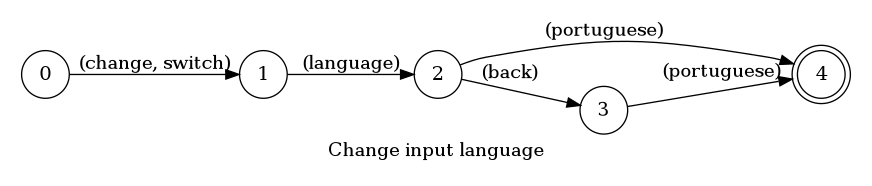

## Change input language

Changes input language to portuguese

### Languages

This command is available in the following languages

**English**

The following automata is responsible for recognizing the command `Change input language` in english:



The following are some examples of phrases, in english, used to trigger the command `Change input language`:

1. change language back portuguese
2. switch language portuguese

**Português**

O automata seguinte é reponsável por reconhecer o comando `Mudar linguagem de entrada` em português:


Os seguintes exemplos de frases, em português, podem ser usadas para ativar o comando `Mudar linguagem de entrada`:

1. mude linguagem inglês

### Implementation

The full implementation of this command can be found on this directory under the file [impl.ts](impl.ts)

```typescript
async function changeLang(command: ParsedPhrase, editor: Editor, context: {}) {
    console.log('[Spoken]: Executing: "changeLang."')
    console.log('This is an internal command this file should never run!')

    return null
}

// @ts-ignore
return changeLang

(...)
```