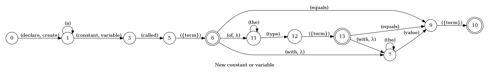
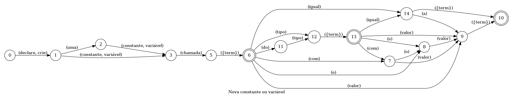

## New constant or variable

Declares a new constant or variable in the current line

### Languages

This command is available in the following languages

**English**

The following automata is responsible for recognizing the command `New constant or variable` in english:



The following are some examples of phrases, in english, used to trigger the command `New constant or variable`:

1. new variable called temp
2. create variable called graph equals a
3. declare constant called text type text equals a
4. declare constant called text type temp

**Portugês**

O automata seguinte é reponsável por reconhecer o comando `Nova constante ou variável` em português:



Os seguintes exemplos de frases, em português, podem ser usadas para ativar o comando `Nova constante ou variável`:

1. crie uma variável chamada a
2. declare variável chamada a
3. declare uma constante chamada valor com o valor lista
4. declare uma constante chamada texto com valor temp
5. crie uma variável chamada valor o valor texto
6. crie uma variável chamada lista valor numero
7. crie uma constante chamada texto do tipo a com o valor numero
8. declare uma variável chamada a do tipo a com valor texto
9. crie uma constante chamada a do tipo texto o valor numero
10. declare uma variável chamada a do tipo numero valor temp
11. declare uma variável chamada lista do tipo a igual a lista
12. crie uma constante chamada temp do tipo valor igual lista
13. crie uma variável chamada texto tipo lista com o valor lista
14. crie uma constante chamada texto tipo valor com valor texto
15. declare uma variável chamada temp tipo a o valor lista
16. crie uma variável chamada a tipo temp valor lista

### Implementation

The full implementation of this command can be found on this directory under the file [impl.ts](impl.ts)

```typescript
async function DeclareVariable(command: ParsedDeclareVariable, editor: Editor, context: {}) {
    console.log('[Spoken]: Executing: "Declare a variable."')

    const memType = command.memType === MemType.constant ? 'const ' : 'let '
    const type = command.type ? `:${command.type}` : ''
    c

(...)
```