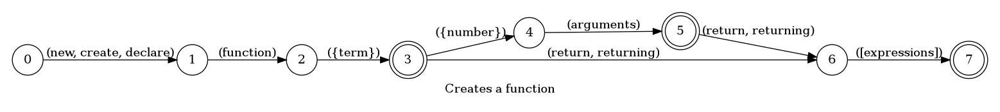
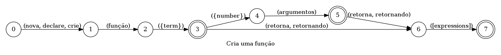

## Creates a function

> 🤖 This document was auto generated by spoken/src/build/build-docs.js

Creates a function with the desired number of args and return value

### Languages

This command is available in the following languages

#### English

The following automata is responsible for recognizing the command `Creates a function` in english:



The following are some examples of phrases, in english, used to trigger the command `Creates a function`:

1. declare function multiply with 123 arguments
2. declare function multiply with 2 arguments return 123
3. declare function divide return reference constant called quote blue car quote

#### Português

O automata seguinte é reponsável por reconhecer o comando `Cria uma função` em português:



Os seguintes exemplos de frases, em português, podem ser usadas para ativar o comando `Cria uma função`:

1. nova função multiplicar com número 43 argumentos
2. nova função multiplicar com 2 argumentos retorna expressão verdadeiro módulo texto U S A texto
3. declare a função dividir retornando falso

### Implementation

The full implementation of this command can be found on this directory under the file [impl.ts](impl.ts)

```typescript
import { Context } from '../../../modules-loader'
import { ParsedPhrase, Editor, WildCard } from '../../d'

async function FunctionDeclaration(command: FunctionDeclarationParsedArgs, editor: Editor, context: Context) {
    console.log('[Spoken]: Executing: "FunctionDeclaration"')

    const an

(...)
```