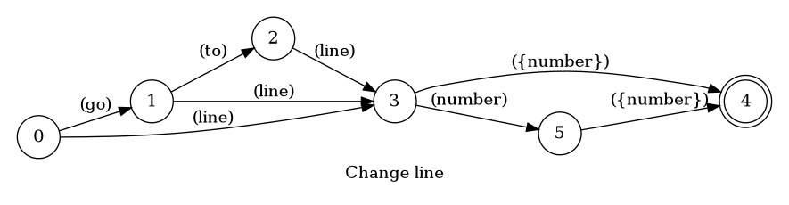
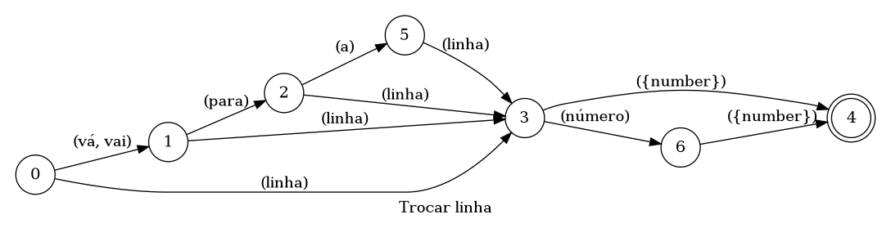

## Change line

> 🤖 This document was auto generated by spoken/src/build/build-docs.js

Moves the cursor to a different line

### Languages

This command is available in the following languages

#### English

The following automata is responsible for recognizing the command `Change line` in english:



The following are some examples of phrases, in english, used to trigger the command `Change line`:

1. go to line number 14
2. go to line number number one
3. line number 123
4. line number five

#### Português

O automata seguinte é reponsável por reconhecer o comando `Trocar linha` em português:



Os seguintes exemplos de frases, em português, podem ser usadas para ativar o comando `Trocar linha`:

1. linha número 14
2. vá para a linha número 14
3. linha número número dois
4. linha número 14

### Implementation

The full implementation of this command can be found on this directory under the file [impl.ts](impl.ts)

```typescript
import { Context } from '../../../modules-loader'
import { ParsedPhrase, Editor, WildCard } from '../../d'

async function goToLine(command: GoToLineParsedArgs, editor: Editor, context: {}) {
    console.log('[Spoken]: Executing: "goToLine."')

    return await editor.goToLine(command.line as 

(...)
```