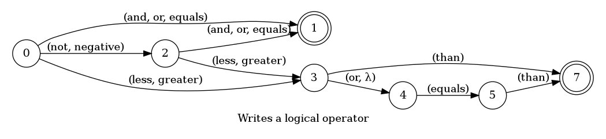
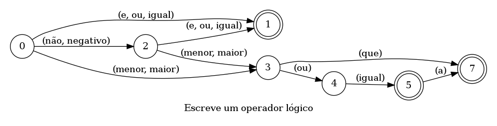

## Writes a logical operator

> 🤖 This document was auto generated by spoken/src/build/build-docs.js

Writes a logical operator (===, !==, &&, ||, >, <, >=, <=) meant to be used inside expressions

### Languages

This command is available in the following languages

#### English

The following automata is responsible for recognizing the command `Writes a logical operator` in english:



The following are some examples of phrases, in english, used to trigger the command `Writes a logical operator`:

1. and
2. or
3. equals
4. less than
5. greater than
6. less or equals than
7. greater or equals than
8. not equals
9. negative equals
10. negative and
11. negative or

#### Português

O automata seguinte é reponsável por reconhecer o comando `Escreve um operador lógico` em português:



Os seguintes exemplos de frases, em português, podem ser usadas para ativar o comando `Escreve um operador lógico`:

1. e
2. ou
3. igual
4. menor que
5. maior que
6. menor ou igual a
7. maior ou igual a
8. não igual
9. negativo igual
10. não e
11. não ou

### Implementation

The full implementation of this command can be found on this directory under the file [impl.ts](impl.ts)

```typescript
import { Context } from '../../../modules-loader'
import { ParsedPhrase, Editor, WildCard } from '../../d'

async function LogicalOperator(command: LogicalOperatorParsedArgs, editor: Editor, context: {}) {
    console.log('[Spoken]: Executing: "LogicalOperator"')

    const { logicalOperator, 

(...)
```