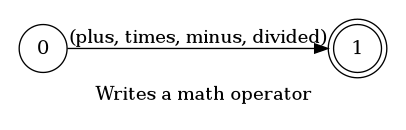
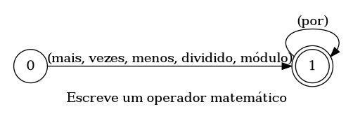

## Writes a math operator

> 🤖 This document was auto generated by spoken/src/build/build-docs.js

Writes a math operator (*, -, +, /, %) meant to be used inside expressions

### Languages

This command is available in the following languages

#### English

The following automata is responsible for recognizing the command `Writes a math operator` in english:



The following are some examples of phrases, in english, used to trigger the command `Writes a math operator`:

1. plus
2. times
3. minus
4. divided by
5. module

#### Português

O automata seguinte é reponsável por reconhecer o comando `Escreve uma operador matemático` em português:



Os seguintes exemplos de frases, em português, podem ser usadas para ativar o comando `Escreve uma operador matemático`:

1. mais
2. vezes
3. menos
4. dividido por
5. módulo

### Implementation

The full implementation of this command can be found on this directory under the file [impl.ts](impl.ts)

```typescript
import { Context } from '../../../modules-loader'
import { ParsedPhrase, Editor, WildCard } from '../../d'

async function MathOperator(command: MathOperatorParsedArgs, editor: Editor, context: {}) {
    console.log('[Spoken]: Executing: "MathOperator"')

    const { mathOperator } = command


(...)
```