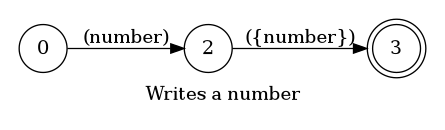
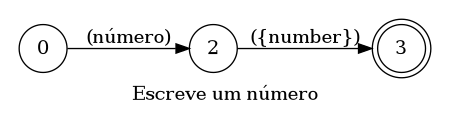

## Writes a number

> 🤖 This document was auto generated by spoken/src/build/build-docs.js

Writes a number in the editor

### Languages

This command is available in the following languages

#### English

The following automata is responsible for recognizing the command `Writes a number` in english:



The following are some examples of phrases, in english, used to trigger the command `Writes a number`:

1. number one
2. number four
3. number five
4. number 43
5. number 14
6. number 140
7. 140
8. 123
9. 42
10. 18

#### Português

O automata seguinte é reponsável por reconhecer o comando `Escreve um número` em português:



Os seguintes exemplos de frases, em português, podem ser usadas para ativar o comando `Escreve um número`:

1. número dois
2. número quatro
3. número cinco
4. número 43
5. número 14
6. número 140

### Implementation

The full implementation of this command can be found on this directory under the file [impl.ts](impl.ts)

```typescript
import { Context } from '../../../modules-loader'
import { ParsedPhrase, Editor, WildCard } from '../../d'

async function WriteNumber(command: WriteNumberParsedArgs, editor: Editor, context: {}) {
    console.log('[Spoken]: Executing: "WriteNumber"')

    const { number, parent } = command


(...)
```