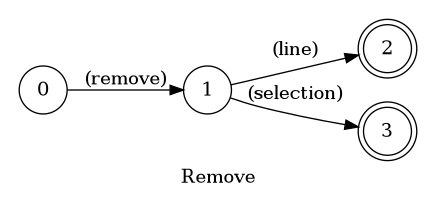
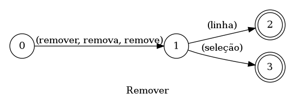

## Remove

> 🤖 This document was auto generated by spoken/src/build/build-docs.js

Removes the current line or the current selection

### Languages

This command is available in the following languages

#### English

The following automata is responsible for recognizing the command `Remove` in english:



The following are some examples of phrases, in english, used to trigger the command `Remove`:

1. remove line
2. remove selection

#### Português

O automata seguinte é reponsável por reconhecer o comando `Remover` em português:



Os seguintes exemplos de frases, em português, podem ser usadas para ativar o comando `Remover`:

1. remover linha
2. remova linha
3. remover seleção

### Implementation

The full implementation of this command can be found on this directory under the file [impl.ts](impl.ts)

```typescript
import { Context } from '../../../modules-loader'
import { ParsedPhrase, Editor, WildCard } from '../../d'

async function remove(command: RemoveParsedArgs, editor: Editor, context: Context) {
    console.log('[Spoken]: Executing: "remove line/selection."')

    if (command.isLine) {
        

(...)
```