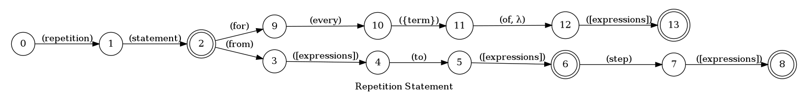
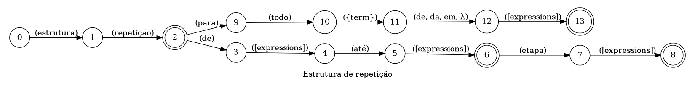

## Creates a for loop statement

> 🤖 This document was auto generated by spoken/src/build/build-docs.js

Creates a for loop statement with the provided expressions as parameters

### Languages

This command is available in the following languages

#### English

The following automata is responsible for recognizing the command `Creates a for loop statement` in english:



The following are some examples of phrases, in english, used to trigger the command `Creates a for loop statement`:

1. repetition statement from number four to 123
2. repetition statement from number 43 to number four step expression variable i plus number 5
3. repetition statement for every car of constant cars
4. repetition statement for every animal of earth
5. repetition statement for every prime of variable primes

#### Português

O automata seguinte é reponsável por reconhecer o comando `Estrutura de repetição` em português:



Os seguintes exemplos de frases, em português, podem ser usadas para ativar o comando `Estrutura de repetição`:

1. estrutura de repetição do número cinco até número cinco
2. estrutura de repetição do número 43 até número cinco etapa expressão variável i mais número 5
3. estrutura de repetição para todo carro em constante carros
4. estrutura de repetição para todo animal na terra
5. estrutura de repetição para todo primo na variável primos

### Implementation

The full implementation of this command can be found on this directory under the file [impl.ts](impl.ts)

```typescript
import { Context } from '../../../modules-loader'
import { ParsedPhrase, Editor, WildCard } from '../../d'

async function Repetition(command: RepetitionParsedArgs, editor: Editor, context: Context) {
    console.log('[Spoken]: Executing: "Repetition."')
    
    const gap = context.templates[

(...)
```