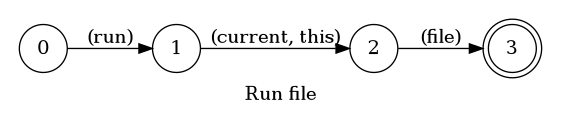
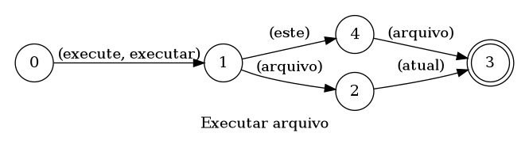

## Run current file

> 🤖 This document was auto generated by spoken/src/build/build-docs.js

Run the current file in the terminal using node

### Languages

This command is available in the following languages

#### English

The following automata is responsible for recognizing the command `Run current file` in english:



The following are some examples of phrases, in english, used to trigger the command `Run current file`:

1. run current file
2. run this file

#### Português

O automata seguinte é reponsável por reconhecer o comando `Executar arquivo` em português:



Os seguintes exemplos de frases, em português, podem ser usadas para ativar o comando `Executar arquivo`:

1. executar este arquivo
2. executar arquivo atual

### Implementation

The full implementation of this command can be found on this directory under the file [impl.ts](impl.ts)

```typescript
import { Context } from '../../../modules-loader'
import { ParsedPhrase, Editor, WildCard } from '../../d'

async function run(command: RunParsedArgs, editor: Editor, context: {}) {
    console.log('[Spoken]: Executing: "run."')

    const info = await editor.fileInfo() as { fileName: string }

(...)
```