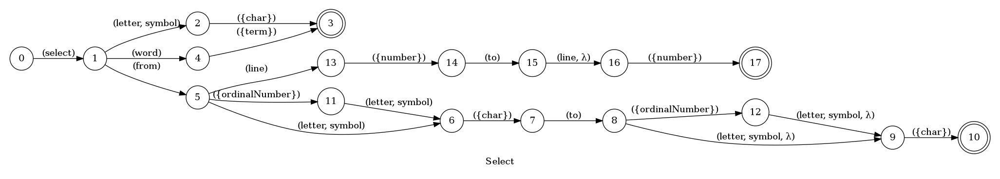
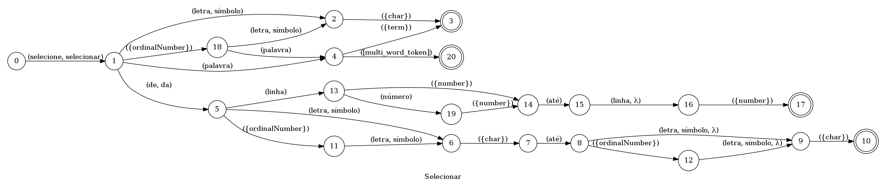

## Select

> 🤖 This document was auto generated by spoken/src/build/build-docs.js

Select a piece of the text in the current line

### Languages

This command is available in the following languages

#### English

The following automata is responsible for recognizing the command `Select` in english:



The following are some examples of phrases, in english, used to trigger the command `Select`:

1. select the letter B
2. select the symbol 5
3. select the letter Q
4. select the first letter B
5. select the second letter K
6. select the last workd this
7. select the word ball
8. select the word quote get color quote
9. select from line 2 to line 15
10. select from line number 45 to line 90
11. select from letter A to letter Z
12. select from second leter G to last letter P

#### Português

O automata seguinte é reponsável por reconhecer o comando `Selecionar` em português:



Os seguintes exemplos de frases, em português, podem ser usadas para ativar o comando `Selecionar`:

1. selecione a letra B
2. selecione a símbolo 5
3. selecione a letra Q
4. selecione a primeira letra B
5. selecione a segunda letra K
6. selecione a última palavra valor
7. selecione a palavra lista
8. selecione a palavra aspas camel case aspas
9. selecione da linha 2 até a linha 15
10. selecione da linha número 45 até a linha 90
11. selecione da letra A até a letra Z
12. selecione da segunda letra G até a última letra P

### Implementation

The full implementation of this command can be found on this directory under the file [impl.ts](impl.ts)

```typescript
import { Context } from '../../../modules-loader'
import { ParsedPhrase, Editor, WildCard } from '../../d'

async function Select(command: SelectParsedArgs, editor: Editor, context: {}) {
    console.log('[Spoken]: Executing: "select"')

    command.word = Array.isArray(command.word) ? command

(...)
```