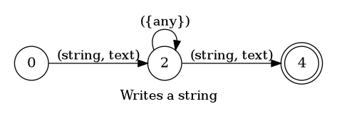
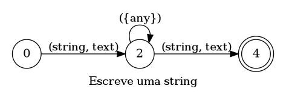

## Writes a string

> 🤖 This document was auto generated by spoken/src/build/build-docs.js

Writes a string in the editor

### Languages

This command is available in the following languages

#### English

The following automata is responsible for recognizing the command `Writes a string` in english:



The following are some examples of phrases, in english, used to trigger the command `Writes a string`:

1. string hello world string
2. string null pointer exeception is bad string
3. text this can be any piece of writing text
4. string hello my name is giovani girogio string
5. text what is happening peter text
6. text H E L L O text
7. string O N U string
8. string U S A string

#### Português

O automata seguinte é reponsável por reconhecer o comando `Escreve uma string` em português:



Os seguintes exemplos de frases, em português, podem ser usadas para ativar o comando `Escreve uma string`:

1. string olá mundo string
2. string erros de ponteiro nulos são ruims string
3. texto podemos dizer qualquer frase texto
4. string Olá meu nome é Giovani Giorgio string
5. texto e ele vai ligar pra todas até achar uma gata pra dar um passeio texto
6. texto U S A texto
7. texto B R T texto
8. string G R A S S string

### Implementation

The full implementation of this command can be found on this directory under the file [impl.ts](impl.ts)

```typescript
import { Context } from '../../../modules-loader'
import { ParsedPhrase, Editor, WildCard } from '../../d'

async function WriteString(command: WriteStringParsedArgs, editor: Editor, context: {}) {
    console.log('[Spoken]: Executing: "WriteString"')

    command.string = Array.isArray(comman

(...)
```