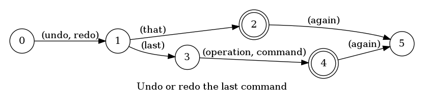
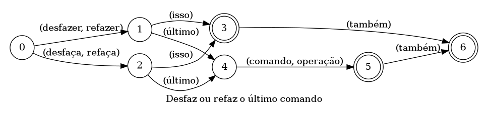

## Undo or redo the last operation/command

> 🤖 This document was auto generated by spoken/src/build/build-docs.js

Undo or redo the last operation, used to correct mistakes. Just like CTRL + (Z | Y).

### Languages

This command is available in the following languages

#### English

The following automata is responsible for recognizing the command `Undo or redo the last operation/command` in english:



The following are some examples of phrases, in english, used to trigger the command `Undo or redo the last operation/command`:

1. undo that
2. undo that again
3. redo the last operation
4. undo the last operation again
5. redo that

#### Português

O automata seguinte é reponsável por reconhecer o comando `Refazer ou desfazer a última operação` em português:



Os seguintes exemplos de frases, em português, podem ser usadas para ativar o comando `Refazer ou desfazer a última operação`:

1. desfaça isso
2. desfazer isto
3. desfaça a última operação
4. refaça isso
5. refazer a última operação

### Implementation

The full implementation of this command can be found on this directory under the file [impl.ts](impl.ts)

```typescript
import { Context } from '../../../modules-loader'
import { ParsedPhrase, Editor, WildCard } from '../../d'

async function undoRedo(command: RunParsedArgs, editor: Editor, context: {}) {
    console.log('[Spoken]: Executing: "Undo/Redo."')

    const task = command.task

    if (task === 0)

(...)
```