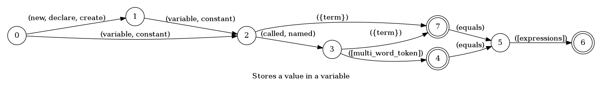
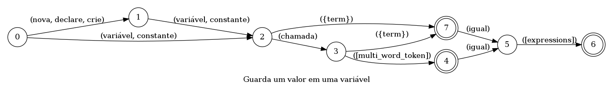

## Stores a value in a variable

> 🤖 This document was auto generated by spoken/src/build/build-docs.js

Stores a number, string etc in a variable

### Languages

This command is available in the following languages

#### English

The following automata is responsible for recognizing the command `Stores a value in a variable` in english:



The following are some examples of phrases, in english, used to trigger the command `Stores a value in a variable`:

1. new variable value equals false
2. variable called batch equals reference constant called quote blue car quote
3. declare variable called quote F A T O S quote equals text H E L L O text

#### Português

O automata seguinte é reponsável por reconhecer o comando `Guarda um valor em uma variável` em português:



Os seguintes exemplos de frases, em português, podem ser usadas para ativar o comando `Guarda um valor em uma variável`:

1. nova variável valor igual a texto U S A texto
2. variável valor igual a falso
3. nova variável chamada aspas W H O aspas igual a expressão verdadeiro módulo texto U S A texto

### Implementation

The full implementation of this command can be found on this directory under the file [impl.ts](impl.ts)

```typescript
import { Context } from '../../../modules-loader'
import { ParsedPhrase, Editor, WildCard } from '../../d'

async function NewVariable(command: NewVariableParsedArgs, editor: Editor, context: {}) {
    console.log('[Spoken]: Executing: "NewVariable"')

    let { isNew, varName, expression, mem

(...)
```