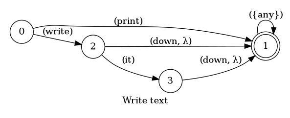
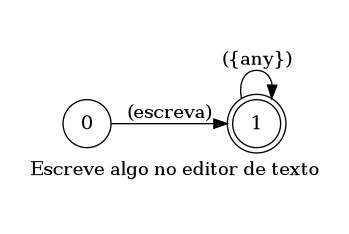

## Write text

> 🤖 This document was auto generated by spoken/src/build/build-docs.js

Write some text in the editor

### Languages

This command is available in the following languages

#### English

The following automata is responsible for recognizing the command `Write text` in english:



The following are some examples of phrases, in english, used to trigger the command `Write text`:

1. write hello how are you friend
2. print my name is Giovani
3. print it down how are you mate
4. write letter B and letter E and letter T

#### Português

O automata seguinte é reponsável por reconhecer o comando `Escrever texto` em português:



Os seguintes exemplos de frases, em português, podem ser usadas para ativar o comando `Escrever texto`:

1. escreva ola como vai você
2. escreva apenas um teste
3. escreva meu nome é giovani girogio
4. escreva letra a B e letra O e letra I

### Implementation

The full implementation of this command can be found on this directory under the file [impl.ts](impl.ts)

```typescript
import { Context } from '../../../modules-loader'
import { ParsedPhrase, Editor } from '../../d'

async function write(command: WriteParsedArgs, editor: Editor, context: Context) {
    console.log('[Spoken]: Executing: "write."')

    let text = null

    if (command.isSpace) text = ' '
   

(...)
```