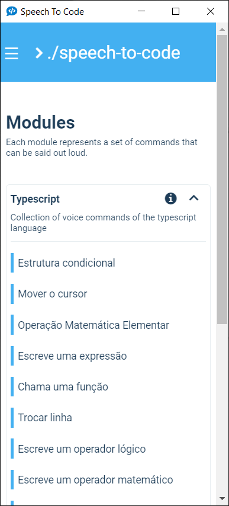

# Webapp

Speech2Code frontend built with `ReactJS`, `SCSS` and `microsoft-cognitiveservices-speech-sdk`. This is the user interface for the whole application.

Besides presenting the results and options to the end user in a friendly way this module is also responsible for: recording audio using the `MediaDevices API`, send the audio to be transformed in text by the `Azure Speech To Text`, using the [Spoken](https://github.com/pedrooaugusto/speech-to-code/tree/main/spoken) module to make sense of text sentences and send the result to Electron via `ipcRenderer`.

 

*Image showing the two main screens of the application*

### Useful Scripts

1. `npm run build` to build the frontend (this folder).

2. `npm run test` to run the tests.

3. `npm start` to start the development server.

